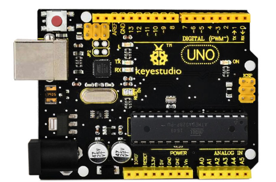
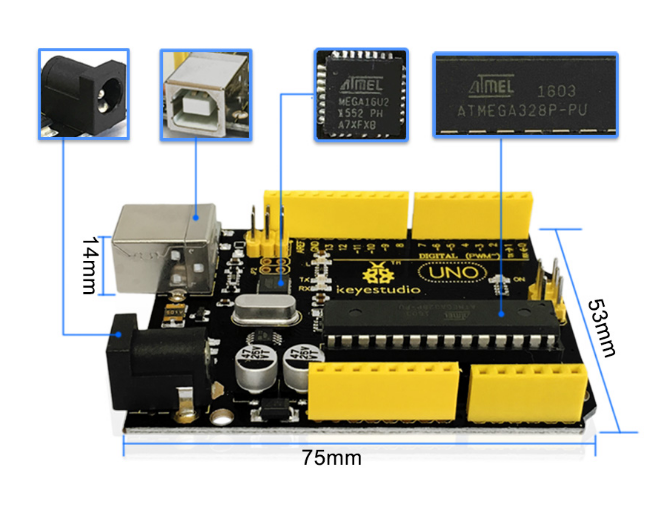
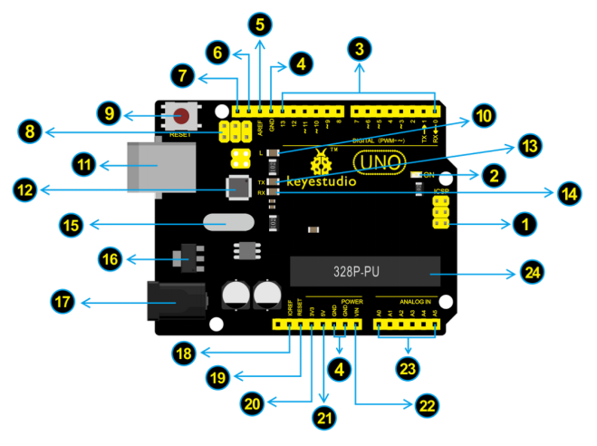

# Keyestudio UNO R3 BOARD

## Introduction

Keyestudio UNO R3 development board is a microcontroller board based onthe ATmega328P (datasheet), fully compatible with ARDUINO UNO REV3. It has 14 digital input/output pins (of which 6 can be used as PWM outputs), 6 analog inputs, a 16 MHz quartz crystal, a USB connection, a power jack, 2 ICSP headers and a reset button.
It contains everything needed to support the microcontroller; simply connect it toa computer with a USB cable or power it with a AC-to-DC adapter or battery to get started.
Note that the two ICSP headers separately used to program the firmware toATMEGA16U2-MU and ATMEGA328P-PU, but we have programmed the two chips, so generally no need to use them.
The Uno R3 differs from all preceding boards in that it does not use the FTDI USB-to-serial driver chip. Instead, it features the Atmega16U2 programmed as aUSB-to-serial converter.
The UNO is the best board to get started with electronics and coding. If this is yourfirst experience tinkering with the platform, the UNO is the most robust board you can start playing with.

## TECH SPECS

|       Microcontroller       |                      ATmega328P-PU                       |
| :-------------------------: | :------------------------------------------------------: |
|      Operating Voltage      |                            5V                            |
| Input Voltage (recommended) |                          7-12V                           |
|      Digital I/O Pins       |            14 (of which 6 provide PWM output)            |
|    PWM Digital I/O Pins     |               6 (D3, D5, D6, D9, D10, D11)               |
|      Analog Input Pins      |                        6 (A0-A5)                         |
|   DC Current per I/O Pin    |                          20 mA                           |
|   DC Current for 3.3V Pin   |                          50 mA                           |
|        Flash Memory         | 32 KB (ATmega328P-PU) of which 0.5 KB used by bootloader |
|            SRAM             |                   2 KB (ATmega328P-PU)                   |
|           EEPROM            |                   1 KB (ATmega328P-PU)                   |
|         Clock Speed         |                          16 MHz                          |
|         LED_BuiltIN         |                           D13                            |

## Dimensions

## Element and Interfaces

Here is an explanation of what every element and interface of the board does:

|  | ***\*ICSP\**** ***\*(In-Circuit Serial Programming) Header\****In most case, ICSP is the AVR，an Arduino micro-program header consisting of MOSI, MISO, SCK, RESET, VCC, and GND. It is often called the SPI (serial peripheral interface) and can be considered an "extension" of the output. In fact, slave the output devices under the SPI bus host.When connecting to PC, program the firmware to ATMEGA328P-PU. |
| ------------------------------------------------------------ | ------------------------------------------------------------ |
|  | ***\*Power\**** ***\*LED\**** ***\*Indicator\****Powering the Arduino, LED on means that your circuit board is correctly powered on. If LED is off, connection is wrong. |
|  | ***\*Digital\**** ***\*I/O\****Arduino UNO has 14 digital input/output pins (of which 6 can be used as PWM outputs). These pins can be configured as digital input pin to read the logic value (0 or 1). Or used as digital output pin to drive different modules like LED, relay, etc. The pin labeled “〜” can be used to generate PWM. |
|  | ***\*GND (\**** ***\*Ground pin\**** ***\*headers)\****Used for circuit ground |
|  | ***\*AREF\**** Reference voltage (0-5V) for analog inputs. Used with [analogReference()](https://www.arduino.cc/reference/en/language/functions/analog-io/analogreference/). |
|  | ***\*SDA\****IIC communication pin                           |
|  | ***\*SCL\****IIC communication pin                           |
|  | ***\*ICSP\**** ***\*(In-Circuit Serial Programming) Header\****In most case, ICSP is the AVR, an Arduino micro-program header consisting of MOSI, MISO, SCK, RESET, VCC, and GND. Connected to ATMEGA 16U2-MU. When connecting to PC, program the firmware to ATMEGA 16U2-MU. |
|  | ***\*RESET\**** ***\*Button\****You can reset your Arduino board, for example, start the program from the initial status. You can use the RESET button. |
|  | ***\*D13 LED\****  There is a built-in LED driven by digital pin 13. When the pin is HIGH value, the LED is on, when the pin is LOW, it's off. |
|  | ***\*USB\**** ***\*Connection\****Arduino board can be powered via USB connector. All you needed to do is connecting the USB port to PC using a USB cable. |
|  | ***\*ATMEGA 16U2-MU\**** USB to serial chip, can convert the USB signal into serial port signal. |
|  | ***\*TX\**** ***\*LED\****Onboard you can find the label: TX (transmit)When Arduino board communicates via serial port, send the message, TX led flashes. |
|  | ***\*RX LED\****Onboard you can find the label: RX(receive )When Arduino board communicates via serial port, receive the message, RX led flashes. |
|  | ***\*Crystal Oscillator\****Helping Arduino deal with time problems. How does Arduino calculate time? by using a crystal oscillator.The number printed on the top of the Arduino crystal is 16.000H9H. It tells us that the frequency is 16,000,000 Hertz or 16MHz. |
|  | ***\*Voltage Regulator\****To control the voltage provided to the Arduino board, as well as to stabilize the DC voltage used by the processor and other components.Convert an external input DC7-12V voltage into DC 5V, then switch DC 5V  to the processor and other components. |
|  | ***\*DC Power Jack\****Arduino board can be supplied with an external power DC7-12V from the DC power jack. |
|  | ***\*IOREF\**** Used to configure the operating voltage of microcontrollers. Use it less. |
|  | ***\*RESET Header\****  Connect an external button to reset the board. The function is the same as reset button (labeled 9) |
|  | ***\*Power\**** ***\*Pin\**** ***\*3\*******\*V\*******\*3\****A 3.3 volt supply generated by the on-board regulator. Maximum current draw is 50 mA. |
|  | ***\*Power\**** ***\*Pin\**** ***\*5V\****Provides 5V output voltage |
|  | ***\*Vin\**** You can supply an external power input DC7-12V through this pin to Arduino board. |
|  | ***\*Analog Pins\****Arduino UNO board has 6 analog inputs, labeled A0 through A5. These pins can read the signal from analog sensors (such as humidity sensor or temperature sensor), and convert it into the digital value that can read by microcontrollers)Can also used as digital pins, A0=D14, A1=D15, A2=D16, A3=D17, A4=D18, A5=D19. |
|  | ***\*Microcontroller\**** Each Arduino board has its own microcontroller. You can regard it as the brain of your board.The main IC (integrated circuit) on the Arduino is slightly different from the panel pair. Microcontrollers are usually from ATMEL. Before you load a new program on the Arduino IDE, you must know what IC is on your board. This information can be checked at the top of IC. |

## Specialized Functions of Some Pins

- Serial communication: Digital pins 0(RX) and 1 (TX).
- PWM Interfaces (Pulse-Width Modulation): D3, D5, D6, D9, D10, D11
- External Interrupts: D2 (interrupt 0) and D3 (interrupt 1). These pins can beconfigured to trigger an interrupt on a low value, a rising or falling edge, or a change in value.
- SPI communication: D10 (SS), D11 (MOSI), D12 (MISO), D13(SCK). Thesepins support SPI communication using the SPI library.
- IIC communication: A4(SDA); A5(SCL)

## Warnings

The Arduino Uno has a resettable polyfuse that protects your computer's USBports from shorts and overcurrent. If more than 500 mA is applied to the USB port, the fuse will automatically break the connection until the short or overload is removed.
Automatic (Software) Reset:
Rather than requiring a physical press of the reset button before an upload, theArduino Uno board is designed in a way that allows it to be reset by software running on a connected computer.
The Uno board contains a trace that can be cut to disable the auto-reset. Thepads on either side of the trace can be soldered together to re-enable it. It's labeled "RESET-EN". You may also be able to disable the auto-reset by connecting a 110 ohm resistor from 5V to the reset line; see this forum thread for details.